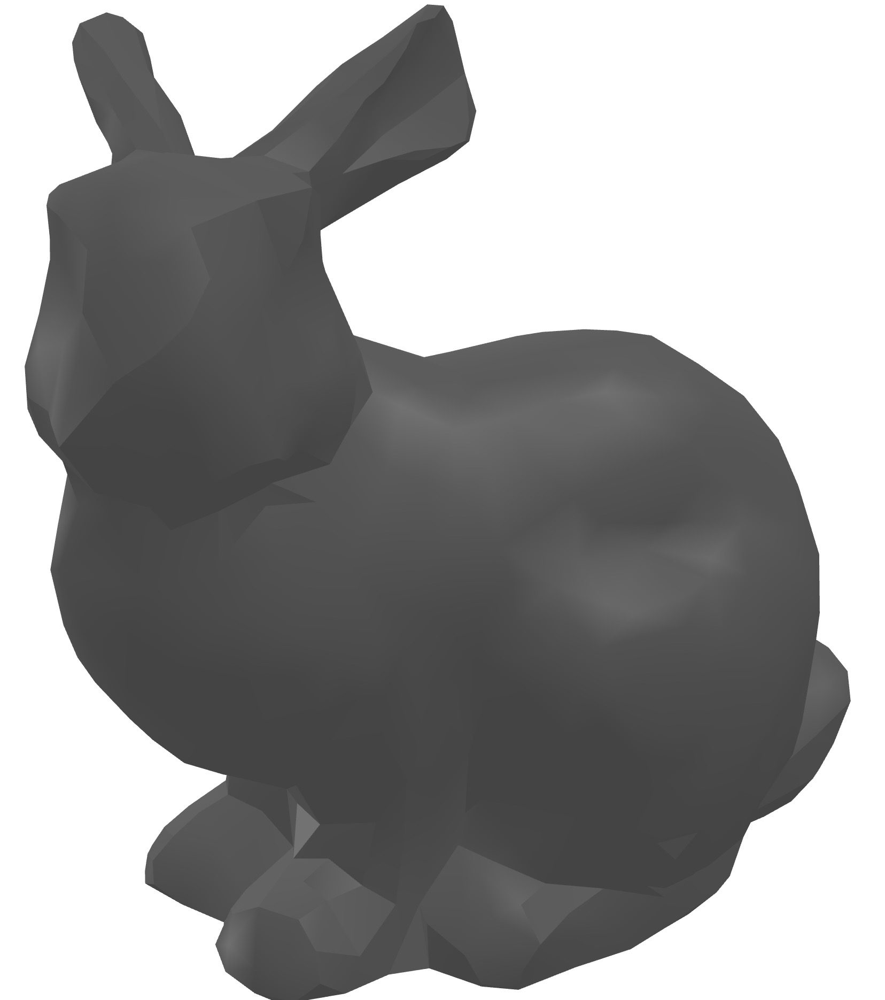
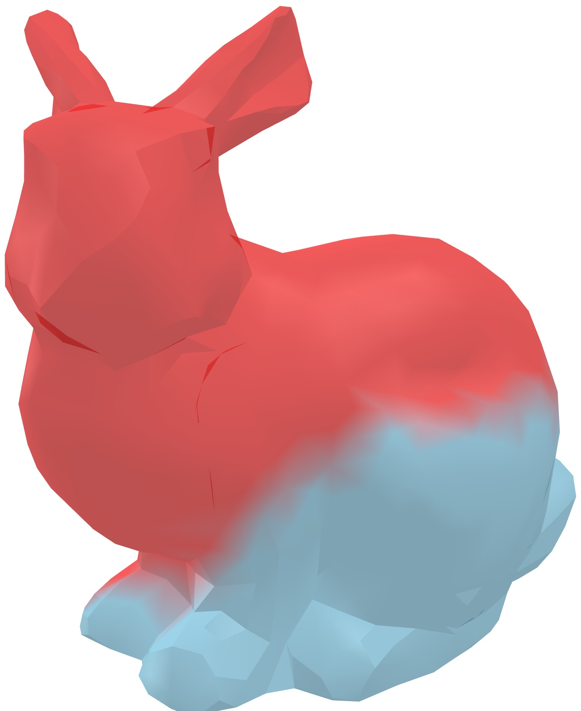
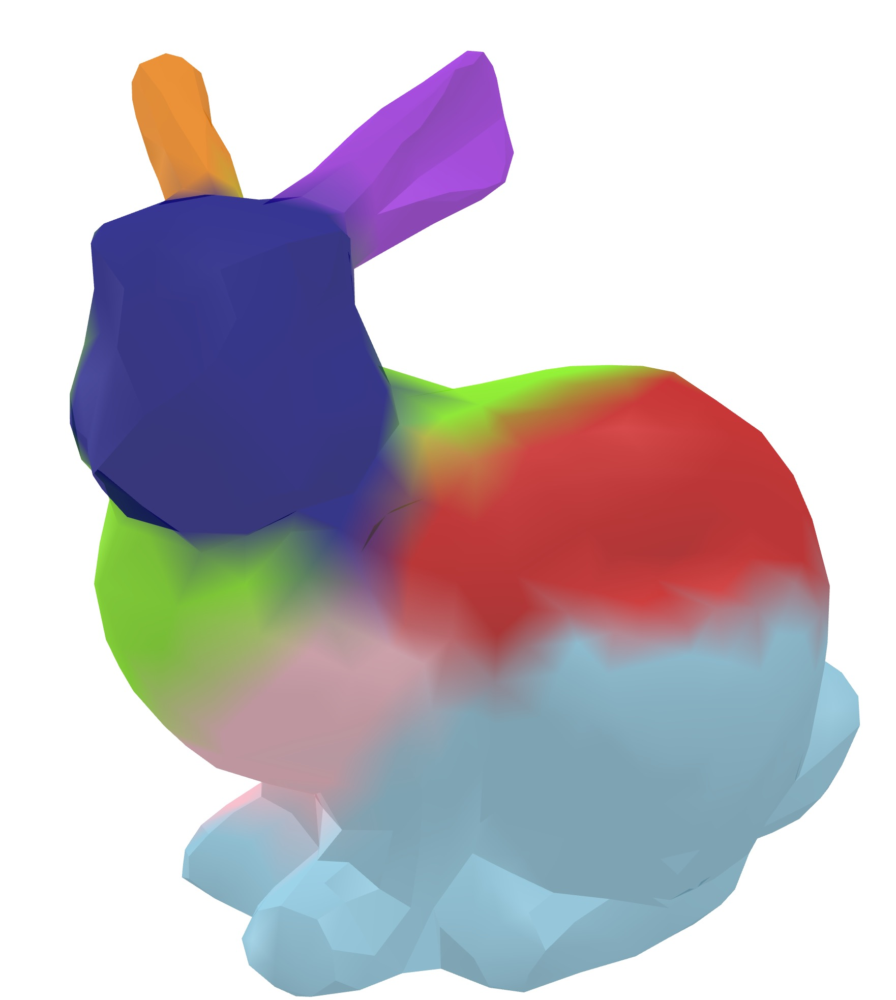

# 计算机图形学第一次大作业

## 王浩宇 计研三一 2022310841

### 算法原理

首先，生成带权对偶图，计算任意两个面片之间的最短距离。然后，确定种子数目并选择种子，计算每个面片属于每一片的概率。对于模糊区域使用最小割算法确定属于哪一面片。递归地对每一片执行以上选择种子、计算概率、划分子片的步骤，直到种子之间的距离小于某个阈值。综上，实现了层次化的k路分解算法。

#### 生成带权对偶图

计算相邻面片之间的测地距离$\text{Geod\_Dict}(f_{i}, f_{j})$与角距离$\text{Ang\_Dict}$，以这两个距离的加权和作为带权对偶图的边权值，以面片作为对偶图的点。
$$
\text{Weight}(f_{i}, f_{j}) = \delta \frac{\text{Geod\_Dict}(f_{i}, f_{j})}{\text{avg}(\text{Geod\_Dict})} + (1 - \delta) \frac{\text{Ang\_Dict}(\alpha_{ij})}{\text{avg}(\text{Ang\_Dict})}
$$

在本实验中，使用csr稀疏矩阵存储带权对偶图。

然后，在带权对偶图上使用Dijkstra算法计算任意两个面片之间的最短距离。

#### 生成种子

首先选一个距离所有面片距离和最小的面片作为第一个种子，之后的每一个种子$\text{REP}_{k}$的选择要最大化到之前种子$\text{REP}_{i}$的最小距离, 即

$$
\text{REP}_{k} = \mathop{\mathrm{arg\,max}}_{\text{REP}_{k}} \min_{i < k} \text{Dist}(\text{REP}_{i}, \text{REP}_{k})
$$

为确定种子的数目，定义$G(k) = \min_{i < k} \text{Dist}(\text{REP}_{i}, \text{REP}_{k})$，选择最大化$G(k)-G(k+1)$的$k$。

#### 区域划分

面片$f_i$属于片$S_j$的概率由$f_i$距离片$j$的种子$\text{REP}_{j}$的距离决定，即：

$$
P(f_{i} \in S_{j}) = \frac{\text{Dist}(f_{i}, \text{REP}_{j})^{-1}}{\sum_{1 \leq l \leq j} \text{Dist}(f_{i}, \text{REP}_{l})^{-1}}
$$

如果面片$f_i$属于片$S_j$的概率相比其他片大很多，就认为$f_i$属于片$S_j$。
如果$P(f_{i} \in S_{j})$与$P(f_{i} \in S_{k})$比较接近，且这二者比属于其他片的概率大很多，那么则认为$f_i$属于片$S_j$与片$S_k$之间的模糊区域。

模糊区域的划分需要重新构图，将模糊区域以及它们相邻的清晰区域的面片集合作为网络流图的点，属于$S_j$的面片与源点$S$连接，属于$S_k$的面片与汇点$T$连接，规定边的代价为

$$
C_{i, j} = \begin{cases} \frac{1}{1 + \frac{\text{Ang\_Dist}(\alpha_{ij})}{\text{avg}(\text{Ang\_Dist})}} & i, j \neq S, T \\ \infty & \text{otherwise} \end{cases}
$$

使用最大流算法求一遍最小割，即可实现对模糊区域的划分（最小割将流图分为两部分，与源点$S$在同一边的面片属于$S_j$，与汇点$T$在同一边的面片属于$S_k$，。

#### 层次化

递归地对每一片执行以上生成种子、计算概率、划分区域的步骤，直到种子之间的距离小于某个阈值$\epsilon$。

### 代码结构

* `main.py`：解析参数，组织整个算法各个环节
* `mesh_solver.py`：实现处理网格的多个函数，包括导入mesh，计算测地距离，计算角距离，生成带权对偶图，生成种子，k路分解，消除模糊区域，建立子图递归分解，可视化分解结果。
* `utils.py`：建立网络流流图，Dijkstra算法，检查种子之间距离是否足够小。
* `flow.py`：最小割算法。

### 运行结果分析

在本实验中，$\delta=0.6,\epsilon=24$。

* 原模型：（ply文件:`/data/bunny.ply`)
  
* 第一层分解结果：k=2（ply文件:`/results/bunny1.ply`)
  
* 第二层分解结果：子片1无需再分解，子片2分解k=8（ply文件:`/results/bunny2.ply`)
  

### 复杂度分析

记面片数为$N$，面片的相邻关系数为$M$（即带权对偶图的边数）
* 生成带权对偶图：计算距离$O(M)$，求任意面片之间的最短距离$O(N^2\log N)$（堆优化的Dijkstra算法）
* 生成种子：选择第一个种子$O(N^2)$，后续种子$O(N)$
* k路分解：计算每一面片的概率$O(kN)$
* 消除模糊区域：最小割算法$O(mn^2)$，由于模糊区域的面片数目很少，所以构建的网络流图规模也很小，这部分不会很消耗时间。
* 层次化：递归停止的阈值较大，划分的区域相对较粗，因此递归消耗时间的也不多

综上，本算法总复杂度为$O(N^2\log N)$，主要耗时在生成带权对偶图时计算最短距离上。